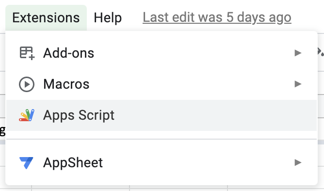

# Run js code on Google sheets via Apps Script

Google sheets offers a service called "Apps Script" that makes it easy to run some javascript code on Google sheets. App scripts also allows to configure event triggers or time-driven triggers that execute custom functions on cue.

Open the interface via `Extensions -> Apps Script`.



The environment exposes the class [`SpreadsheetApp`](https://developers.google.com/apps-script/reference/spreadsheet/spreadsheet-app) to interact with spreadsheets.

For example, to read data from a named sheet:

```js
function main() {
  const ss = SpreadsheetApp.getActiveSpreadsheet();

  // select a sheet by name and get its data
  const sourceSheet = ss.getSheetByName("My sheet");
  let data = sourceSheet.getDataRange().getValues();
}
```

Or, to write data to a named sheet:

```js
function main() {
  const ss = SpreadsheetApp.getActiveSpreadsheet();

  // get sheet by its name and reset
  let outSheet = ss.getSheetByName("Another sheet");
  outSheet.clear();

  // append header row
  outSheet.appendRow(["col-1", "col-2", "col-3"]);
  // append data
  outSheet
    .getRange(outSheet.getLastRow() + 1, 1, someData.length, someData[0].length)
    .setValues(someData);
}
```
